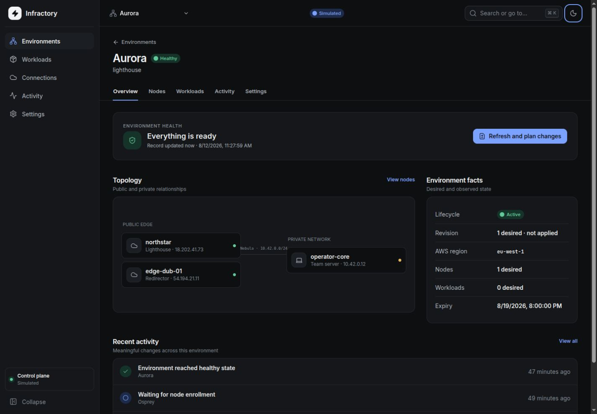
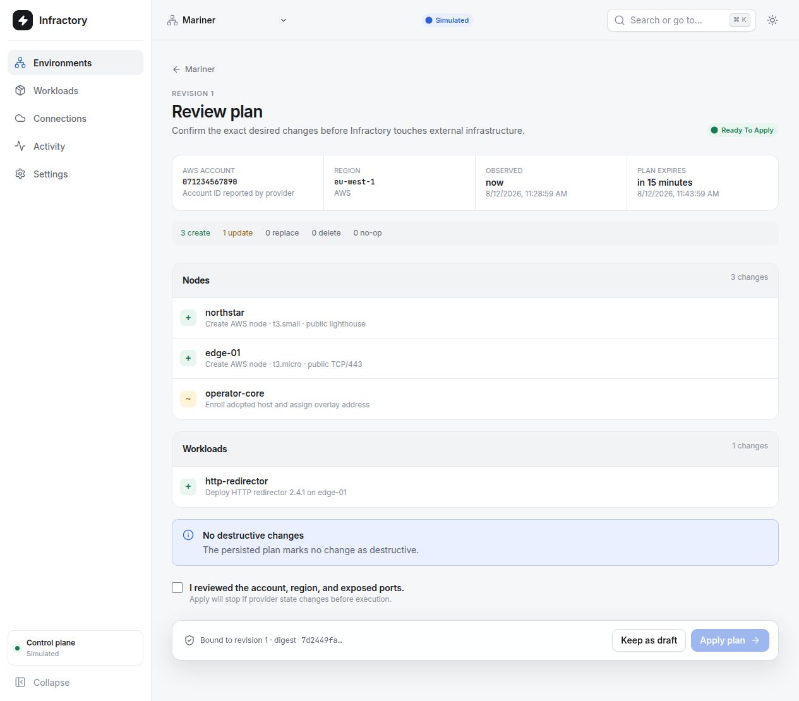
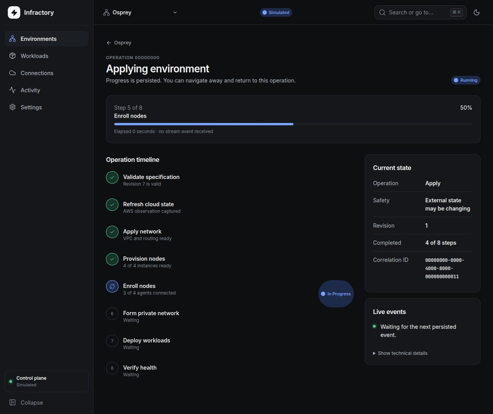
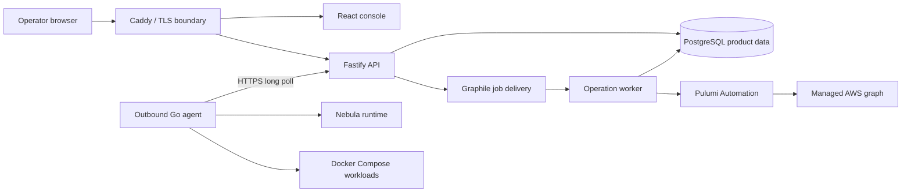

# Infractory v2

> A self-hosted control plane for planning, deploying, observing, and safely tearing down reproducible infrastructure environments.

Infractory turns an environment specification into AWS infrastructure, an isolated Nebula network, and versioned Docker Compose workloads. Operators work through a review-first interface; durable operations keep the desired state, observed state, and partial failures visible without requiring a terminal.

V2 is a greenfield application. It does not import, migrate, or depend on the original Java implementation.



## Why Infractory

Infrastructure orchestration usually becomes dangerous at its least convenient moments: a worker dies halfway through an apply, a host goes offline during teardown, or a provider accepts a request whose final result is unknown. Infractory treats those as normal product states rather than exceptional log messages.

- **Review before mutation.** Plans are immutable, account- and region-bound, and expire after 15 minutes.
- **Truthful recovery.** Operations persist every fixed step and distinguish failure, blocking, cancellation, and unknown external outcomes.
- **Observed health.** Provider state, agent reachability, private-network health, and workload probes remain separate signals.
- **Safe host management.** Agents connect outbound over HTTPS and expose typed actions instead of a remote shell.
- **Constrained workloads.** Workload versions are immutable, digest-pinned, validated Compose packages with declared inputs, exposures, secrets, and probes.
- **Auditable teardown.** Destroy completes only after refresh and residue inspection; adopted hosts are detached, never deleted or rebooted.

## Product tour

### Understand an environment at a glance

The environment view leads with health, the next safe action, topology, and observed facts. Provider identifiers, certificates, raw events, and runtime details remain available through contextual diagnostics rather than dominating the interface.

### Review the exact change



Plans show create, update, replacement, deletion, and no-op counts; group changes by node and workload; and bind the approval to an exact revision, AWS account, region, provider observation, and toolchain version. Apply is disabled when the plan is stale or blocked.

### Follow durable progress



Each operation has a closed sequence of persisted steps. The console survives navigation and refresh, resumes its event stream, explains whether the current state is safe, partial, or unknown, and recommends a recovery action before exposing technical details.

> The screenshots above are captured from the real React application with its explicit simulated-data mode enabled. Simulated mode is visibly labelled and is never used as a fallback for failed production requests.

## First-release scope

In scope:

- Single-tenant, self-hosted control plane
- One externally supplied AWS account and one region per environment
- AWS-managed Ubuntu 24.04 x86-64 nodes
- Adopted Ubuntu 22.04/24.04 and Debian 12 hosts on amd64 or arm64
- One Nebula network and CA per environment, with one lighthouse by default
- Versioned Docker Compose workloads pinned to nodes
- Plan, apply, observe, retry, reconcile, clone, destroy, detach, and abandon workflows
- Accurate partial-failure and residual-resource reporting

Deliberately deferred:

- V1 migration or compatibility
- Multi-user organizations, RBAC, SSO, or SaaS tenancy
- Additional cloud providers, DNS, domains, and TLS automation
- Kubernetes, Nomad, Swarm, autoscaling, or a visual blueprint editor
- Git-synchronized workloads, a marketplace, cost estimation, or remote shell access

## Architecture



The implementation is a modular monolith with one PostgreSQL dependency and explicit ownership boundaries:

| Authority | Owns | Does not own |
| --- | --- | --- |
| PostgreSQL | Product intent, immutable revisions, operations, observations, credentials | Applied AWS child-resource graph |
| Pulumi | Managed AWS state and dependency graph | Adopted hosts, Nebula, workloads, product lifecycle |
| Graphile Worker | Transactional job delivery | Product workflow semantics |
| Node agent | Host/runtime execution and observations | Environment intent or cloud resources |

There is no workflow DSL, event bus, Redis queue, Kubernetes controller, or generic remote-execution layer. Each operation kind advances a fixed, persisted sequence one step at a time.

Read [the architecture guide](docs/architecture.md) and the [architecture decisions](docs/adr/) for the deeper rationale.

## Repository layout

```text
v2/
├── apps/
│   ├── control-plane/    Fastify API, worker, migrations, provider boundary
│   ├── web/              React operator console and design system
│   └── agent/            Outbound Go agent and Nebula PKI helper
├── packages/contracts/   Canonical TypeBox schemas and generated artifacts
├── blueprints/           Versioned built-in environment presets
├── deploy/               Production images, Caddy, and PostgreSQL setup
├── docs/                 Architecture, ADRs, operations, and recovery
├── scripts/              Build and verification entry points
└── compose.yaml          Self-hosted control-plane stack
```

## Quick start

Requirements:

- Node.js 24
- pnpm 9.15.4 through Corepack
- Docker with Compose
- Go 1.25 only when building the node agent outside its container

```sh
cd v2
corepack enable
./scripts/init-secrets.sh
pnpm install --frozen-lockfile
pnpm verify
docker compose up --build
```

The default stack uses the deterministic fake infrastructure driver and binds the unauthenticated console to loopback. The generated `.env` is mode `0600`; `init-secrets.sh` refuses to overwrite an existing file.

To run only the UI with clearly labelled sample data:

```sh
VITE_DEMO_MODE=true pnpm --filter @infractory/web dev
```

The operator console is served through Caddy at `PUBLIC_ADDRESS`. Before using the Pulumi driver, provide the standard AWS credential chain, dedicated PostgreSQL Pulumi backend, stable HTTPS URL, encryption secrets, and Pulumi passphrase described in [.env.example](.env.example).

Do not expose this authentication-deferred release directly to the public Internet. Place it behind the operator's private network boundary.

## Development and verification

`pnpm verify` is the complete local verification entry point. It checks:

- V1/workspace isolation
- Generated OpenAPI and Go contract drift
- Strict TypeScript type checking
- Control-plane and web tests
- Production frontend and server builds
- Go formatting, tests, vet, and static agent/PKI builds
- Docker Compose configuration

Useful focused commands:

```sh
pnpm --filter @infractory/control-plane test
pnpm --filter @infractory/web verify
./scripts/verify-agent.sh
./scripts/verify-compose.sh
```

PostgreSQL integration tests run when `TEST_DATABASE_URL` is present. The fake infrastructure adapter exercises the complete persisted plan/apply/destroy path without cloud credentials; it does not replace live-cloud qualification.

## Safety model

- Process startup validates configuration and schema only; it never mutates cloud or host state.
- Every external mutation belongs to an idempotent, persisted operation.
- Provider or agent outcomes that cannot be proven become reconciliation work, not success.
- Only one mutating operation may run for an environment at a time.
- Agent tasks carry a generation, stable action key, lease, deadline, and bounded receipt history.
- The agent executes argv arrays, has no inbound listener, and has no generic shell task.
- Secrets are encrypted at rest, hydrated only at dispatch, and written to release-local mode-`0400` files.
- Workloads cannot request privileged mode, host networking, Docker socket mounts, arbitrary host paths, or undeclared public ports.
- AWS tag discovery is an audit and recovery mechanism, never permission for broad deletion.

See [operations](docs/operations.md) and [backup and recovery](docs/backup-recovery.md) before managing real infrastructure.

## Current maturity

The durable fake vertical slice, product UI, control-plane containers, contracts, agent runtime, workload admission, and Pulumi integration boundary are implemented and verified locally.

Release qualification still requires:

- Repeated live AWS create/deploy/destroy runs and residue audits
- Worker, database, credential-loss, and restore fault drills against real infrastructure
- Live adopted-host, Nebula, registry, workload-update, and rollback exercises
- Two-phase Nebula CA rotation, revocation acknowledgement, and lighthouse reachability validation
- Automatic expiry job scheduling—the expiry value is currently persisted and displayed
- The console specification editor for creating replacement immutable revisions

These items remain explicit gates; the application does not convert an unobserved or ambiguous result into optimistic success.

## Documentation

- [Architecture](docs/architecture.md)
- [Operations](docs/operations.md)
- [Backup and recovery](docs/backup-recovery.md)
- [Modular monolith ADR](docs/adr/0001-modular-monolith.md)
- [Pulumi ownership ADR](docs/adr/0002-pulumi-boundary.md)
- [Outbound agent ADR](docs/adr/0003-outbound-agent.md)
- [Worker and controller reliability ADR](docs/adr/0004-worker-and-controller-reliability.md)

## License

Licensed under the repository's [Apache License 2.0](../LICENSE).
